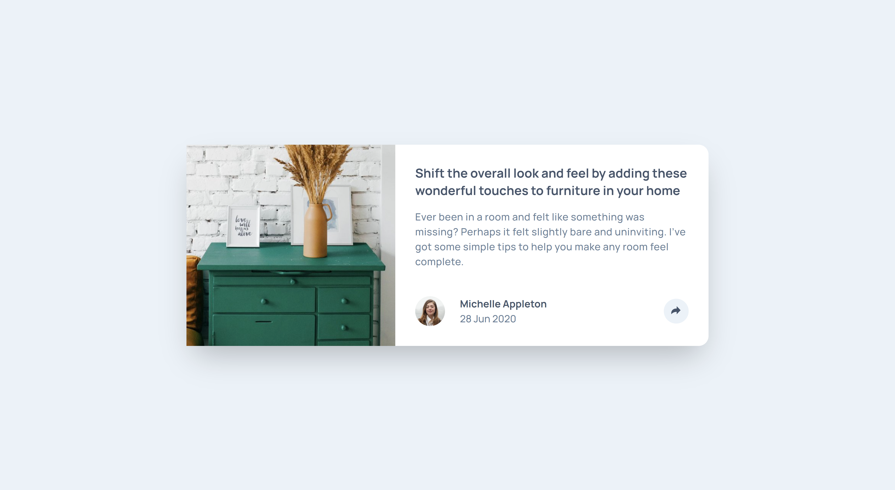
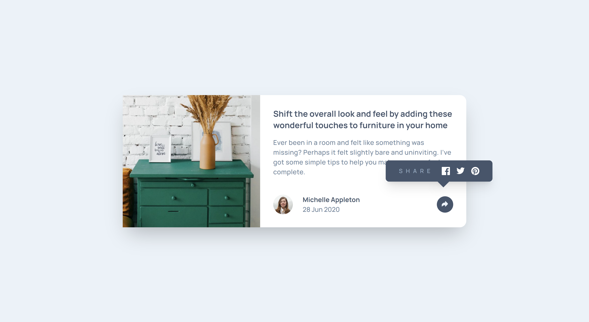

# Frontend Mentor - Article preview component solution

This is a solution to the [Article preview component challenge on Frontend Mentor](https://www.frontendmentor.io/challenges/article-preview-component-dYBN_pYFT).

## Table of contents

- [Overview](#overview)
  - [The challenge](#the-challenge)
  - [Screenshot](#screenshot)
  - [Links](#links)
- [My process](#my-process)
  - [Built with](#built-with)
  - [What I learned](#what-i-learned)
  - [Continued development](#continued-development)
- [Author](#author)

## Overview

### The challenge

Users should be able to:

- View the optimal layout for the component depending on their device's screen size
- See the social media share links when they click the share icon

### Screenshot

### Links

- Solution URL: [Add solution URL here](https://github.com/m00nta/article-preview-component-master)
- Live Site URL: [Add live site URL here](https://m00nta.github.io/article-preview-component-master/)

## My process

### Built with

- Semantic HTML5 markup
- - [Tailwind CSS Framework](https://tailwindcss.com/) - For styles
- Flexbox
- CSS Grid
- Mobile-first workflow

### What I learned

It was a little bit hard at first to do Mobile-first workflow but as soon as I started coding I notice the difference, It's much easier and structure to do Mobile-first workflow. Also this is my first time combinig tailwind with JavaScript, so I am still learning the workflow to work with Tailwind and JavaScript DOM manipulation seemlessly

### Continued development

I am going to work with TailwindCSS to learn the best approach and practice to work with the DOM.

## Author

- Twitter - [@m00nta](https://twitter.com/m00nta)
- Frontend Mentor - [@m00nta](https://www.frontendmentor.io/profile/m00nta)
